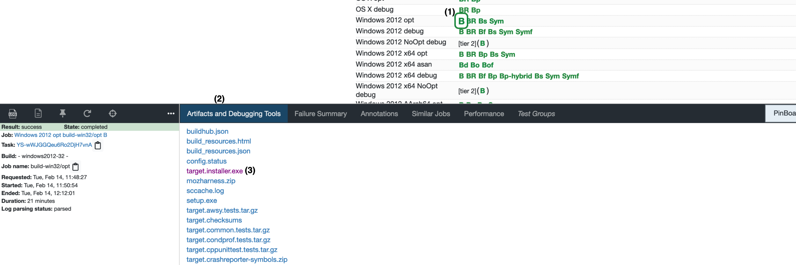

# Modified Firefox Nightly version (for Secure Credential Provision Extension)

This modified Firefox Nightly was developed within the scope of my bachelor thesis to test the [experimental _Secure Credential Provision_ extension](https://github.com/1rneh/secure-credential-provision-extension#readme). It only servers as proof of concept.

---

The preference signon.secureCredentialProvision.enabled enabled the changes, when it's set to true.

What is changed when the preference is set to true?

Before the LoginManagerParent sends credentials to the LoginManagerChild it calls `processSecureCredentialProvision`:

```
    if (lazy.LoginHelper.secureCredentialProvisionEnabled) {
      jsLogins = lazy.LoginHelper.processSecureCredentialProvision(jsLogins);
    }
```

The method implementation:

```
  /**
   * Processes the changes due to Secure Credential Provision
   * 1. Creates a new object {dummyId, dummyPassword, realPassword, origin},
   * converts it to a JSON object and dispatches it in the event "secure-credential-provision"
   * 2. modifies the existing logins and replaces the realPassword with the dummyPassword
   *
   * @param {Object} logins
   *            logins from the storage, filtered by a specific origin
   * @returns {Object}
   *            logins striped of the information about the real password
   */
  processSecureCredentialProvision(logins) {
    let infos = [];
    logins.forEach(login => {
      let info = {
        dummyId: `dummy-${login.username}-${login.origin}`,
        dummyPassword: LoginHelper.secureCredentialProvisionDummyValue,
        realPassword: login.password,
        origin: login.origin,
      };
      infos.push(info);
      login.password = info.dummyPassword;
    });
    Services.obs.notifyObservers(
      null,
      "passwordmgr-on-receive-credential-info",
      JSON.stringify(infos)
    );
    return logins;
  },
```

---

## Installation options

### 1. Option: Include files in your local build

1. If you have a local build of Firefox Nightly, just exchange the files from the directory _local-build_ with the ones from your local Nightly build.

   **all.js**: modules/libpref/init/all.js\
   **LoginHelper.jsm**: toolkit/components/passwordmgr/LoginHelper.jsm\
   **LoginManagerParent.jsm**: toolkit/components/passwordmgr/LoginManagerParent.jsm\
   **LoginManagerPrompter.jsm**: toolkit/components/passwordmgr/LoginManagerPrompter.jsm

2. Rebuild and run the application

### 2. Option: Download the installation file for you operating system

The installation files for Windows, Linux and OS X are provided in the dedicated directories in the repository.

Or choose one yourself from [these builds](https://treeherder.mozilla.org/jobs?repo=try&revision=b02a3a062262134945b3775b428f20a403a5c7c1) (see screenshot with instructions). To get the installer file, click the B for "Build" next to the os version (1), click Artifacts and Debugging Tools (2) and choose the installation file (3).

- Windows: target.installer.exe
- Linux:
- OS X: target.dmg



## Preference settings

To prepare the browser for the experimental API extension, visit about:config and set the following preferences:

1. **xpinstall.signatures.required** to false
2. **extensions.experiments.enabled** to true
3. **signon.secureCredentialProvision.enabled** to true, to enable the browser sided code changes of the prototype
